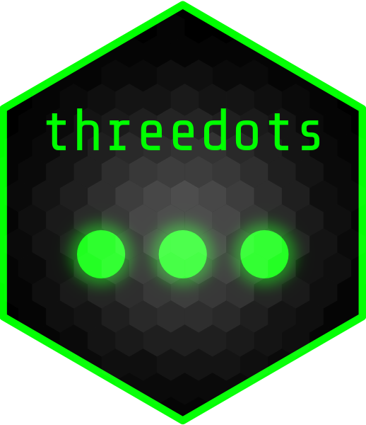

# threedots: Modify `...` directly <a href="https://docu.openrepgrid.org"></a>

<!-- README.md is generated from README.Rmd. Please edit that file -->
<!-- badges: start -->


<!-- badges: end -->

Modify the dots (`...`) directly inside the function body.

## Installation

You can install the development version of threedots like so:

``` r
remotes::install_github("markheckmann/threedots")
```

## Modify the dots

The common way to modify the dots and pass them to another function is
to use `do.call()`:

``` r
fun <- \(...) {
  dots <- list(...)
  dots$new_arg <- 999
  do.call(list, dots)
}

fun(a = 1)
#> $a
#> [1] 1
#> 
#> $new_arg
#> [1] 999
```

`{threedots}` allows to modify the dots directly via `modify_dots()`. It
is basically a small wrapper around for the `do.call` approach above.

``` r
library(threedots)

fun <- \(...) {
  modify_dots(new_arg = 999)
  list(...)
}

fun(a = 1)
#> $a
#> [1] 1
#> 
#> $new_arg
#> [1] 999
```

You can use the dots component’s names inside `modify_dots()` for
calculations using the `.()` function.

``` r
fun <- \(...) {
  modify_dots(a = .(a) * 100) # multiply by 100
  list(...)
}

fun(a = 1)
#> $a
#> [1] 100
```

## Making the dots function-safe

There may be situations, where you need to clean the dots, so that they
do not contain unknown arguments. Below, `fun()` does not know arg `c`
and throws an error.

``` r
fun <- \(a = 1, b = 2) {
  list(a = a, b = b)
}

foo <- \(...) {
  fun(...)
}

foo(c = -999)
#> Error in fun(...): unused argument (c = -999)
```

One way to deal with that is again the `do.call` approach plus cleaning
the list.

``` r
foo <- \(...) {
  dots <- list(...)
  args_known <- names(formals(fun))
  args_given <- names(dots)
  args_keep <- intersect(args_given, args_known)
  do.call(fun, dots[args_keep]) # only insert known args
}
foo(a = 100, c = -999)
#> $a
#> [1] 100
#> 
#> $b
#> [1] 2
```

`safe_dots()` modifies the dots in place by removing all args unkown to
`fun()`.

``` r
foo <- \(...) {
  safe_dots(fun) # make dots safe to use with `fun`
  fun(...)
}

foo(a = 100, c = -999)
#> $a
#> [1] 100
#> 
#> $b
#> [1] 2
```
